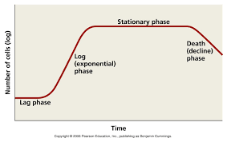
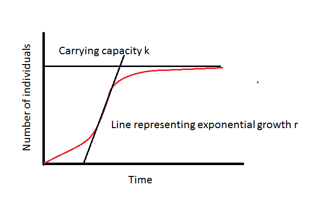

# Setup

0. Requirements:

[R](https://www.r-project.org/)

[RStudio](https://rstudio.com/products/rstudio/download/)


In console run:


```{r setup}
knitr::opts_knit$set(root.dir = 'C:/Users/alexg/Google Drive/05-Proyectos/restlab_workshop/01-MarianaRius-Growthcurver/')

#If you want to convert this Rmarkdown document into an R script. Run the following.
#knitr::purl("pathtofile/file.Rmd",documentation=2)

#Or setwd() 
#setwd('C:/Users/alexg/Google Drive/05-Proyectos/restlab_workshop/01-MarianaRius-Growthcurver/')
```


Install the packages

```{r eval=FALSE, include=TRUE}
install.packages("tidyverse")
install.packages("rlist")
install.packages("growthcurver")
install.packages("lubridate")
```


1. Download datasets or locate your own data you would like to use.

IMPORTANT: For the script to run properly an independent folder containing the data file is 

- Datasets provided:

    - LAA-E2.xlsx
      - OD data - Single reads per well
      - LAA = Laby Antibiotic Assay
      - [plate setup](https://docs.google.com/presentation/d/1jRHy32pm0gParXaoHVKo8pyVgZAvbHmZJvZlcpzZYKc/edit?usp=sharing)
      - 96 wells
      - 16 time points
      - No media blank
      - Excel file
        - sheets arranged reverse chronologically (most recent **first** )
        - OD reads start at row 27 (header = row 26)
        - Date and time on row 23
        - Last sheet is not blank

    - NGE-E1-P3.xlsx
      - OD Data - Multiple reads per well
      - NGE = Nutrient Growth Experiment
      - [plate setup](https://docs.google.com/presentation/d/1Fe_pQ2ebTqtWHqC9wkUPmBWrXytWQm8loQvxyXw0EWs/edit?usp=sharing)
      - 96 wells
      - 6 time points
      - No media blank
      - Excel file
        - Sheets arranged reverse chronologically (most recent **first** )
        - OD reads start at row 48 (header = row 47)
        - Date and time on row 25
        - Last sheet is blank


# Growthcurver Intro

## Growth phases of a culture



Logistic equation (used by growthcurver)

$$N_{t}=\frac{K}{1+\frac{K-N_{0}}{N_{0}}e^{-rt}}$$

$N_{t}$ = population at time $t$

$K$ = carrying capacity

$N_{0}$ = initial population size

$r$ = intrinsic growth rate



# R/ RStudio Orientation

- Script, Console, Environment, Help
- R basics
  - making objects
  - Object types
    - numeric, character, factor, vector, data.frame, list
  - for loop
  - functions
    - c() and trick to building a recursive vector
    - head() and tail()

# Pipeline

We will be following this vignette: [Growthcurver](https://cran.r-project.org/web/packages/growthcurver/vignettes/Growthcurver-vignette.html)

## Pipeline breakdown:

  1. Setup script
  2. Load data
  3. Organize data for growthcurver
  4. Run growthcurver
  5. Plot growthcurver output
  6. PCA &amp; plot
  7. Sigma histogram
  8. Plot parameters


## LAA-E2.xlsx

### 1. Setup script

```{r}
options(stringsAsFactors = F)
#total wells
tw<-96
#filename
fn<-"data/LAA-E2.xlsx"
#replicates?
x<-3
#number of antibiotic concentrations
nc<-12
#number of strains #JUST AURLI
ns<-1
```

############
### 2. Load data
```{r echo=TRUE}
library("tidyverse")
library("readxl")

sheets <- excel_sheets(fn)


exceltable <- sheets  %>%
  as.list() %>% 
  map(read_excel,path=fn,col_names = FALSE) %>% 
  map(as_tibble)

names(exceltable) <- paste("t-", sheets, sep = "")


sheetslist <- exceltable %>% 
  map(slice,27:34) %>% #This selects the OD values
  map(select,-1)


for (i in 1:length(sheetslist)){
  colnames(sheetslist[[i]]) <- as.character(c(paste0(0,1:9),10:12))
  sheetslist[[i]]$rows <- LETTERS[1:8]
  sheetslist[[i]] <- sheetslist[[i]] %>% gather(1:12,key="column",value="OD")
}

sheetslist <- sheetslist %>%
  map(as.tibble) %>% 
  map(mutate,well=paste0(rows,column)) %>% 
  map(mutate,OD=as.numeric(OD))
```


AllSheets is a list of dataframes. Each dataframe contains a value for OD, well, row and column.
```{r}
sheetslist[[1]] %>% 
  head()
```


You can filter your wells using the filter condition, by row, column or both.
```{r}
#Select only the first 3 rows
allSheets <- sheetslist %>% 
 map(filter,rows==c("A","B","C")) %>% 
  map(arrange,well)

allSheets[[1]] %>%
  head()
```


### 3. Organize data for growthcurver

```{r}
#calculate difference in time
timelist <- exceltable  %>% 
  map(select,2) %>% 
  map(slice,23:24)

vec <- timelist %>%
  unlist() 
vec <- vec[!is.na(vec)]

library(lubridate)
time <- data.frame(ID=sheets,
                   time = mdy_hms(vec)) %>% 
  as_tibble() %>% 
  arrange(time)%>%
  mutate(dur = time - time[1]) %>% 
  mutate(dur=as.duration(dur)) %>% 
  mutate(dur=as.numeric(dur,"hours"))
```

what does time look like?

```{r}
time %>% head() 
```


```{r}
allSheets1 <- allSheets %>%
  map(select,well,OD)%>%
  map(spread,key="well",value="OD")

df <- bind_rows(allSheets1, .id = "ID") %>%
  arrange(ID) %>% 
  as.data.frame()

t <- time %>% 
  arrange(ID)%>%
  select(-ID) %>%
  as.data.frame()

final <- cbind(t,df) %>%
  as_tibble() %>%
  select(-ID,-time) %>%
  rename(time=dur) %>%
  mutate(time=as.numeric(time))%>%
  as.data.frame()
```

what does final look like?

```{r}
final %>% 
  head()

```


```{r}
table1 <- final %>% as_tibble() %>% 
  gather(2:dim(final)[2],key = "ID",value="OD")


table1 %>% ggplot(aes(x=time,y=OD,color=ID))+
  geom_point()+
  facet_wrap(.~ID)+
  theme_minimal()+
  geom_smooth(se=FALSE)+
  labs(title = "Growth Experiments",
              subtitle = "Plots of Optical Density as a function of time",
              caption = "Data source: LAA-E2.xlsx",x="Time (hours)",y="Optical Density")
```


### 4.Run growthcurver

Take a look at the vignettes for growthcurver
[Growthcurver vignettes](https://cran.r-project.org/web/packages/growthcurver/vignettes/Growthcurver-vignette.html)


```{r}
library("growthcurver")
gc_out <- SummarizeGrowthByPlate(final)
```


what does gc_out look like?

```{r}
gc_out %>% 
  head()
```


Additional parameters provided in gc\_out

t\_mid _= t, ½ K,_ the time at which the population density reaches half the carrying capacity

t\_gen = doubling time, the least amount of time required to double the population

auc\_l = the area under the modeled logistic curve (integral of the logistic equation)

auc\_e = the area under the curve obtained from the optical density readings data

sigma = residual standard deviation, the estimated standard deviation of the errors // residual sum of squares from the fit of the logistic curve to the data, so larger values mean poorer fits, a parameter used to evaluate the &#39;goodness of fit&#39;

```{r eval=FALSE}
write.csv(gc_out,file="results/aurli_growthcurver_output.csv") 
save(gc_out,file="results/aurli_growthcurver_output.rda")
```


### 6. Plot growthcurver output

```{r}
d<-final
gc_out <- SummarizeGrowthByPlate(d, plot_fit = TRUE, 
                                 plot_file = "results/gc_plots.pdf")
```


```{r}
# Let's create an output data frame to store the results in. 
# We'll create it so that it is the right size (it's faster this way!), 
# but leave it empty.
num_analyses <- length(names(d)) - 1
d_gc <- data.frame(sample = character(num_analyses),
                   k = numeric(num_analyses),
                   n0  = numeric(num_analyses),
                   r = numeric(num_analyses),
                   t_mid = numeric(num_analyses),
                   t_gen = numeric(num_analyses),
                   auc_l = numeric(num_analyses),
                   auc_e = numeric(num_analyses),
                   sigma = numeric(num_analyses),
                   stringsAsFactors = FALSE)

# Truncate or trim the input data to observations occuring in the first 20 hours.
# Remember that the times in these sample data are reported in hours. To use  
# minutes (or to trim at a different time), change the next line of code. 
# For example, if you still would like to trim at 20 hours, but your time data 
# are reported in minutes use: trim_at_time <- 20 * 60

trim_at_time<- as.numeric(max(time$dur))#set our preferred plotting range based on tdif


#pdf("results/LAA-E2_growthcurver_r.pdf", height = 8.5, width = 11) 

par(mfrow = c(8,12))
par(mar = c(0.25,0.25,0.25,0.25))
y_lim_max <- max(d[,setdiff(names(d), "time")]) - min(d[,setdiff(names(d), "time")])

n <- 1    # keeps track of the current row in the output data frame
for (col_name in names(d)) {
  
  # Don't process the column called "time". 
  # It contains time and not absorbance data.
  if (col_name != "time") {
    
    # Create a temporary data frame that contains just the time and current col
    d_loop <- d[, c("time", col_name)]
    
    # Do the background correction.
    # Background correction option 1: subtract the minimum value in a column
    #                                 from all measurements in that column
    min_value <- min(d_loop[, col_name])
    d_loop[, col_name] <- d_loop[, col_name] - min_value
    # Background correction option 2: subtract the mean value of blank wells
    #                                 over the course the experiment
    #                                 (Replace B2, D8, G11 with the column
    #                                  names of your media-only wells)
    #d$blank <- apply(d[, c("B2", "D8", "G11")], 1, mean)
    #d$A1 <- d$A1 - d$blank
    
    # Now, call Growthcurver to calculate the metrics using SummarizeGrowth
    gc_fit <- SummarizeGrowth(data_t = d_loop[, "time"], 
                              data_n = d_loop[, col_name],
                              t_trim = trim_at_time,
                              bg_correct = "none")
    
    # Now, add the metrics from this column to the next row (n) in the 
    # output data frame, and increment the row counter (n)
    d_gc$sample[n] <- col_name
    d_gc[n, 2:9] <- c(gc_fit$vals$k,
                      gc_fit$vals$n0,
                      gc_fit$vals$r,
                      gc_fit$vals$t_mid,
                      gc_fit$vals$t_gen,
                      gc_fit$vals$auc_l,
                      gc_fit$vals$auc_e,
                      gc_fit$vals$sigma)
    n <- n + 1
    
    # Finally, plot the raw data and the fitted curve
    # Here, I'll just print some of the data points to keep the file size smaller
    ggplot(as.data.frame(gc_fit$data),aes(x=t,y=N))+
      xlim(c(0, trim_at_time))+
      ylim(c(0, y_lim_max))+
      geom_point()+
      theme_minimal()+
      labs(title=col_name)
  }
}

#dev.off()

```


### 6. PCA and plot

```{r}
# Load dplyr, ggplot2, and the sample data
library(dplyr)
library(ggplot2)
pca_gc_out <- as_data_frame(gc_out) 

# Prepare the gc_out data for the PCA
rownames(pca_gc_out) <- pca_gc_out$sample
# Do the PCA
pca.res <- prcomp(pca_gc_out %>% select(k:sigma), center=TRUE, scale=TRUE)
# Plot the results
as_data_frame(list(PC1=pca.res$x[,1],
                   PC2=pca.res$x[,2],
                   samples = rownames(pca.res$x))) %>% 
  ggplot(aes(x=PC1,y=PC2, label=samples)) + 
  geom_text(size = 3)


# Do the PCA with percentages in axes
pca.res <- prcomp(pca_gc_out %>% select(k:sigma), center=TRUE, scale=TRUE)
percentage <- round(pca.res$sdev / sum(pca.res$sdev) * 100, 2)
df_out <- as.data.frame(pca.res$x)
percentage <- paste( colnames(df_out), "(", paste( as.character(percentage), "%", ")", sep="") )
# Plot the results
as_data_frame(list(PC1=pca.res$x[,1],
                   PC2=pca.res$x[,2],
                   samples = rownames(pca.res$x))) %>% 
  ggplot(aes(x=PC1,y=PC2, label=samples)) + geom_text(size = 3) + xlab(percentage[1]) + ylab(percentage[2])

```

### 7. Sigma histogram

```{r}
# Plot a histogram of the sigma values in order to check for outliers
gc_out %>% 
  ggplot(aes(x=sigma))+
  theme_minimal()+
  labs(title = "Histogram of sigma values",
              caption = "Data source: LAA-E2.xlsx")+
  geom_histogram(fill="lightblue",col="darkblue")
```

### 8. Plot parameters

```{r}
gc_out %>%
  gather(2:9,key="parameter",value = "value") %>% 
  select(-note) %>% 
  ggplot(aes(y=value,x=parameter))+
  theme_minimal()+
  facet_wrap(.~parameter,scales="free_y")+
  labs(title = "Distribution of the parameter",
              caption = "Data source: LAA-E2.xlsx")+
  geom_boxplot()
```

