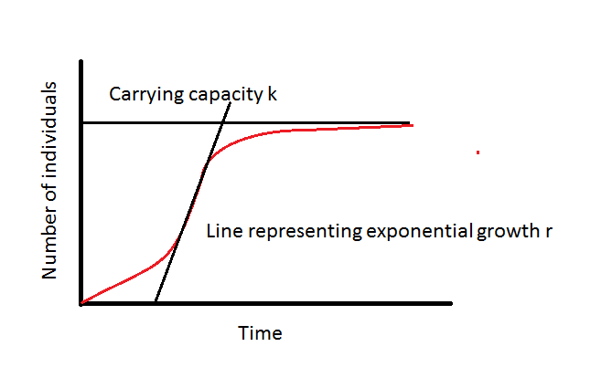

Script
================
Mariana Rius
4/24/2020

# Setup

0.  Requirements:

[R](https://www.r-project.org/)

[RStudio](https://rstudio.com/products/rstudio/download/)

In console run:

``` r
knitr::opts_knit$set(root.dir = 'C:/Users/alexg/Google Drive/05-Proyectos/restlab_workshop/01-MarianaRius-Growthcurver/')

#If you want to convert this Rmarkdown document into an R script. Run the following.
#knitr::purl("pathtofile/file.Rmd",documentation=2)

#Or setwd() 
#setwd('C:/Users/alexg/Google Drive/05-Proyectos/restlab_workshop/01-MarianaRius-Growthcurver/')
```

Install the packages

``` r
install.packages("tidyverse")
install.packages("rlist")
install.packages("growthcurver")
install.packages("lubridate")
```

1.  Download datasets or locate your own data you would like to use.

IMPORTANT: For the script to run properly an independent folder
containing the data file is

  - Datasets provided:
    
      - LAA-E2.xlsx
          - OD data - Single reads per well
          - LAA = Laby Antibiotic Assay
          - [plate
            setup](https://docs.google.com/presentation/d/1jRHy32pm0gParXaoHVKo8pyVgZAvbHmZJvZlcpzZYKc/edit?usp=sharing)
          - 96 wells
          - 16 time points
          - No media blank
          - Excel file
              - sheets arranged reverse chronologically (most recent
                **first** )
              - OD reads start at row 27 (header = row 26)
              - Date and time on row 23
              - Last sheet is not blank
      - NGE-E1-P3.xlsx
          - OD Data - Multiple reads per well
          - NGE = Nutrient Growth Experiment
          - [plate
            setup](https://docs.google.com/presentation/d/1Fe_pQ2ebTqtWHqC9wkUPmBWrXytWQm8loQvxyXw0EWs/edit?usp=sharing)
          - 96 wells
          - 6 time points
          - No media blank
          - Excel file
              - Sheets arranged reverse chronologically (most recent
                **first** )
              - OD reads start at row 48 (header = row 47)
              - Date and time on row 25
              - Last sheet is blank

# Growthcurver Intro

## Growth phases of a culture


Logistic equation (used by growthcurver)

\[N_{t}=\frac{K}{1+\frac{K-N_{0}}{N_{0}}e^{-rt}}\]

\(N_{t}\) = population at time \(t\)

\(K\) = carrying capacity

\(N_{0}\) = initial population size

\(r\) = intrinsic growth rate



# R/ RStudio Orientation

  - Script, Console, Environment, Help
  - R basics
      - making objects
      - Object types
          - numeric, character, factor, vector, data.frame, list
      - for loop
      - functions
          - c() and trick to building a recursive vector
          - head() and tail()

# Pipeline

We will be following this vignette:
[Growthcurver](https://cran.r-project.org/web/packages/growthcurver/vignettes/Growthcurver-vignette.html)

## Pipeline breakdown:

1.  Setup script
2.  Load data
3.  Organize data for growthcurver
4.  Run growthcurver
5.  Plot growthcurver output
6.  PCA & plot
7.  Sigma histogram
8.  Plot parameters

## LAA-E2.xlsx

### 1\. Setup script

``` r
options(stringsAsFactors = F)
#total wells
tw<-96
#filename
fn<-"data/LAA-E2.xlsx"
#replicates?
x<-3
#number of antibiotic concentrations
nc<-12
#number of strains #JUST AURLI
ns<-1
```

# 

### 2\. Load data

``` r
library("tidyverse")
```

    ## -- Attaching packages ----------------------------------------------------------------------- tidyverse 1.3.0 --

    ## v ggplot2 3.3.0     v purrr   0.3.3
    ## v tibble  2.1.3     v dplyr   0.8.5
    ## v tidyr   1.0.2     v stringr 1.4.0
    ## v readr   1.3.1     v forcats 0.5.0

    ## -- Conflicts -------------------------------------------------------------------------- tidyverse_conflicts() --
    ## x dplyr::filter() masks stats::filter()
    ## x dplyr::lag()    masks stats::lag()

``` r
library("readxl")

sheets <- excel_sheets(fn)


exceltable <- sheets  %>%
  as.list() %>% 
  map(read_excel,path=fn,col_names = FALSE) %>% 
  map(as_tibble)
```

    ## New names:
    ## * `` -> ...1
    ## * `` -> ...2
    ## * `` -> ...3
    ## * `` -> ...4
    ## * `` -> ...5
    ## * ... and 8 more problems

    ## New names:
    ## * `` -> ...1
    ## * `` -> ...2
    ## * `` -> ...3
    ## * `` -> ...4
    ## * `` -> ...5
    ## * ... and 8 more problems
    ## New names:
    ## * `` -> ...1
    ## * `` -> ...2
    ## * `` -> ...3
    ## * `` -> ...4
    ## * `` -> ...5
    ## * ... and 8 more problems
    ## New names:
    ## * `` -> ...1
    ## * `` -> ...2
    ## * `` -> ...3
    ## * `` -> ...4
    ## * `` -> ...5
    ## * ... and 8 more problems
    ## New names:
    ## * `` -> ...1
    ## * `` -> ...2
    ## * `` -> ...3
    ## * `` -> ...4
    ## * `` -> ...5
    ## * ... and 8 more problems
    ## New names:
    ## * `` -> ...1
    ## * `` -> ...2
    ## * `` -> ...3
    ## * `` -> ...4
    ## * `` -> ...5
    ## * ... and 8 more problems
    ## New names:
    ## * `` -> ...1
    ## * `` -> ...2
    ## * `` -> ...3
    ## * `` -> ...4
    ## * `` -> ...5
    ## * ... and 8 more problems
    ## New names:
    ## * `` -> ...1
    ## * `` -> ...2
    ## * `` -> ...3
    ## * `` -> ...4
    ## * `` -> ...5
    ## * ... and 8 more problems
    ## New names:
    ## * `` -> ...1
    ## * `` -> ...2
    ## * `` -> ...3
    ## * `` -> ...4
    ## * `` -> ...5
    ## * ... and 8 more problems
    ## New names:
    ## * `` -> ...1
    ## * `` -> ...2
    ## * `` -> ...3
    ## * `` -> ...4
    ## * `` -> ...5
    ## * ... and 8 more problems
    ## New names:
    ## * `` -> ...1
    ## * `` -> ...2
    ## * `` -> ...3
    ## * `` -> ...4
    ## * `` -> ...5
    ## * ... and 8 more problems
    ## New names:
    ## * `` -> ...1
    ## * `` -> ...2
    ## * `` -> ...3
    ## * `` -> ...4
    ## * `` -> ...5
    ## * ... and 8 more problems
    ## New names:
    ## * `` -> ...1
    ## * `` -> ...2
    ## * `` -> ...3
    ## * `` -> ...4
    ## * `` -> ...5
    ## * ... and 8 more problems
    ## New names:
    ## * `` -> ...1
    ## * `` -> ...2
    ## * `` -> ...3
    ## * `` -> ...4
    ## * `` -> ...5
    ## * ... and 8 more problems
    ## New names:
    ## * `` -> ...1
    ## * `` -> ...2
    ## * `` -> ...3
    ## * `` -> ...4
    ## * `` -> ...5
    ## * ... and 8 more problems
    ## New names:
    ## * `` -> ...1
    ## * `` -> ...2
    ## * `` -> ...3
    ## * `` -> ...4
    ## * `` -> ...5
    ## * ... and 8 more problems

``` r
names(exceltable) <- paste("t-", sheets, sep = "")


sheetslist <- exceltable %>% 
  map(slice,27:34) %>% #This selects the OD values
  map(select,-1)


for (i in 1:length(sheetslist)){
  colnames(sheetslist[[i]]) <- as.character(c(paste0(0,1:9),10:12))
  sheetslist[[i]]$rows <- LETTERS[1:8]
  sheetslist[[i]] <- sheetslist[[i]] %>% gather(1:12,key="column",value="OD")
}

sheetslist <- sheetslist %>%
  map(as.tibble) %>% 
  map(mutate,well=paste0(rows,column)) %>% 
  map(mutate,OD=as.numeric(OD))
```

AllSheets is a list of dataframes. Each dataframe contains a value for
OD, well, row and column.

``` r
sheetslist[[1]] %>% 
  head()
```

    ## # A tibble: 6 x 4
    ##   rows  column     OD well 
    ##   <chr> <chr>   <dbl> <chr>
    ## 1 A     01     0.120  A01  
    ## 2 B     01     0.114  B01  
    ## 3 C     01     0.155  C01  
    ## 4 D     01     0.117  D01  
    ## 5 E     01     0.0792 E01  
    ## 6 F     01     0.0966 F01

You can filter your wells using the filter condition, by row, column or
both.

``` r
#Select only the first 3 rows
allSheets <- sheetslist %>% 
 map(filter,rows==c("A","B","C")) %>% 
  map(arrange,well)

allSheets[[1]] %>%
  head()
```

    ## # A tibble: 6 x 4
    ##   rows  column     OD well 
    ##   <chr> <chr>   <dbl> <chr>
    ## 1 A     01     0.120  A01  
    ## 2 A     04     0.0416 A04  
    ## 3 A     07     0.0818 A07  
    ## 4 A     10     0.0405 A10  
    ## 5 B     01     0.114  B01  
    ## 6 B     04     0.0419 B04

### 3\. Organize data for growthcurver

``` r
#calculate difference in time
timelist <- exceltable  %>% 
  map(select,2) %>% 
  map(slice,23:24)

vec <- timelist %>%
  unlist() 
vec <- vec[!is.na(vec)]

library(lubridate)
```

    ## 
    ## Attaching package: 'lubridate'

    ## The following objects are masked from 'package:dplyr':
    ## 
    ##     intersect, setdiff, union

    ## The following objects are masked from 'package:base':
    ## 
    ##     date, intersect, setdiff, union

``` r
time <- data.frame(ID=sheets,
                   time = mdy_hms(vec)) %>% 
  as_tibble() %>% 
  arrange(time)%>%
  mutate(dur = time - time[1]) %>% 
  mutate(dur=as.duration(dur)) %>% 
  mutate(dur=as.numeric(dur,"hours"))
```

what does time look like?

``` r
time %>% head() 
```

    ## # A tibble: 6 x 3
    ##   ID               time                    dur
    ##   <chr>            <dttm>                <dbl>
    ## 1 LAA-E2-S1-T01-P1 2015-11-13 12:49:00  0     
    ## 2 LAA-E2-S1-T02-P1 2015-11-13 12:51:19  0.0386
    ## 3 LAA-E2-S1-T03-P1 2015-11-13 12:53:06  0.0683
    ## 4 LAA-E2-S1-T04-P1 2015-11-13 22:55:33 10.1   
    ## 5 LAA-E2-S1-T05-P1 2015-11-14 15:27:31 26.6   
    ## 6 LAA-E2-S1-T06-P1 2015-11-14 21:30:52 32.7

``` r
allSheets1 <- allSheets %>%
  map(select,well,OD)%>%
  map(spread,key="well",value="OD")

df <- bind_rows(allSheets1, .id = "ID") %>%
  arrange(ID) %>% 
  as.data.frame()

t <- time %>% 
  arrange(ID)%>%
  select(-ID) %>%
  as.data.frame()

final <- cbind(t,df) %>%
  as_tibble() %>%
  select(-ID,-time) %>%
  rename(time=dur) %>%
  mutate(time=as.numeric(time))%>%
  as.data.frame()
```

what does final look like?

``` r
final %>% 
  head()
```

    ##          time    A01    A04    A07    A10    B01    B04    B07    B10    C01
    ## 1  0.00000000 0.0374 0.0443 0.0385 0.0387 0.0406 0.0464 0.0394 0.0393 0.0418
    ## 2  0.03861111 0.0389 0.0449 0.0385 0.0379 0.0394 0.0463 0.0385 0.0395 0.0457
    ## 3  0.06833333 0.0391 0.0462 0.0395 0.0385 0.0402 0.0495 0.0393 0.0400 0.0417
    ## 4 10.10916667 0.0412 0.0440 0.0391 0.0393 0.0406 0.0439 0.0389 0.0390 0.0429
    ## 5 26.64194444 0.0722 0.0431 0.0400 0.0397 0.2426 0.0450 0.0395 0.0394 0.2355
    ## 6 32.69777778 0.2557 0.0433 0.0396 0.0396 0.3796 0.0441 0.0536 0.0384 0.3752
    ##      C04    C07    C10
    ## 1 0.0474 0.0422 0.0402
    ## 2 0.0482 0.0404 0.0395
    ## 3 0.0499 0.0402 0.0404
    ## 4 0.0443 0.0403 0.0398
    ## 5 0.0451 0.0412 0.0404
    ## 6 0.0441 0.0419 0.0400

``` r
table1 <- final %>% as_tibble() %>% 
  gather(2:dim(final)[2],key = "ID",value="OD")


table1 %>% ggplot(aes(x=time,y=OD,color=ID))+
  geom_point()+
  facet_wrap(.~ID)+
  theme_minimal()+
  geom_smooth(se=FALSE)+
  labs(title = "Growth Experiments",
              subtitle = "Plots of Optical Density as a function of time",
              caption = "Data source: LAA-E2.xlsx",x="Time (hours)",y="Optical Density")
```

    ## `geom_smooth()` using method = 'loess' and formula 'y ~ x'

<!-- -->

### 4.Run growthcurver

Take a look at the vignettes for growthcurver [Growthcurver
vignettes](https://cran.r-project.org/web/packages/growthcurver/vignettes/Growthcurver-vignette.html)

``` r
library("growthcurver")
gc_out <- SummarizeGrowthByPlate(final)
```

what does gc\_out look like?

``` r
gc_out %>% 
  head()
```

    ##   sample           k           n0          r     t_mid     t_gen      auc_l
    ## 1    A01 0.168751162 4.276198e-17 1.29647692  27.69934  0.534639 20.4558933
    ## 2    A04 0.001499999 3.067910e-03 0.01641622 -40.88960 42.223322  0.2846144
    ## 3    A07 0.068173039 8.154181e-17 0.56156530  61.18560  1.234313  5.9810260
    ## 4    A10 0.002071613 5.131656e-04 0.14637824   7.58888  4.735316  0.2887522
    ## 5    B01 0.197771807 4.297463e-04 0.35850848  17.09722  1.933419 26.0693545
    ## 6    B04 0.001599999 5.244593e-03 0.03094241 -11.76226 22.401200  0.2992986
    ##        auc_e        sigma                      note
    ## 1 20.6634118 0.0787390901                          
    ## 2  0.1949968 0.0009334011 questionable fit (k < n0)
    ## 3  5.3204288 0.0254546373                          
    ## 4  0.2950915 0.0004539442                          
    ## 5 25.0220222 0.1010221596                          
    ## 6  0.2454720 0.0011268840 questionable fit (k < n0)

Additional parameters provided in gc\_out

t\_mid *= t, ½ K,* the time at which the population density reaches half
the carrying capacity

t\_gen = doubling time, the least amount of time required to double the
population

auc\_l = the area under the modeled logistic curve (integral of the
logistic equation)

auc\_e = the area under the curve obtained from the optical density
readings data

sigma = residual standard deviation, the estimated standard deviation of
the errors // residual sum of squares from the fit of the logistic curve
to the data, so larger values mean poorer fits, a parameter used to
evaluate the ‘goodness of fit’

``` r
write.csv(gc_out,file="results/aurli_growthcurver_output.csv") 
save(gc_out,file="results/aurli_growthcurver_output.rda")
```

### 6\. Plot growthcurver output

``` r
d<-final
gc_out <- SummarizeGrowthByPlate(d, plot_fit = TRUE, 
                                 plot_file = "results/gc_plots.pdf")
```

``` r
# Let's create an output data frame to store the results in. 
# We'll create it so that it is the right size (it's faster this way!), 
# but leave it empty.
num_analyses <- length(names(d)) - 1
d_gc <- data.frame(sample = character(num_analyses),
                   k = numeric(num_analyses),
                   n0  = numeric(num_analyses),
                   r = numeric(num_analyses),
                   t_mid = numeric(num_analyses),
                   t_gen = numeric(num_analyses),
                   auc_l = numeric(num_analyses),
                   auc_e = numeric(num_analyses),
                   sigma = numeric(num_analyses),
                   stringsAsFactors = FALSE)

# Truncate or trim the input data to observations occuring in the first 20 hours.
# Remember that the times in these sample data are reported in hours. To use  
# minutes (or to trim at a different time), change the next line of code. 
# For example, if you still would like to trim at 20 hours, but your time data 
# are reported in minutes use: trim_at_time <- 20 * 60

trim_at_time<- as.numeric(max(time$dur))#set our preferred plotting range based on tdif


#pdf("results/LAA-E2_growthcurver_r.pdf", height = 8.5, width = 11) 

par(mfrow = c(8,12))
par(mar = c(0.25,0.25,0.25,0.25))
y_lim_max <- max(d[,setdiff(names(d), "time")]) - min(d[,setdiff(names(d), "time")])

n <- 1    # keeps track of the current row in the output data frame
for (col_name in names(d)) {
  
  # Don't process the column called "time". 
  # It contains time and not absorbance data.
  if (col_name != "time") {
    
    # Create a temporary data frame that contains just the time and current col
    d_loop <- d[, c("time", col_name)]
    
    # Do the background correction.
    # Background correction option 1: subtract the minimum value in a column
    #                                 from all measurements in that column
    min_value <- min(d_loop[, col_name])
    d_loop[, col_name] <- d_loop[, col_name] - min_value
    # Background correction option 2: subtract the mean value of blank wells
    #                                 over the course the experiment
    #                                 (Replace B2, D8, G11 with the column
    #                                  names of your media-only wells)
    #d$blank <- apply(d[, c("B2", "D8", "G11")], 1, mean)
    #d$A1 <- d$A1 - d$blank
    
    # Now, call Growthcurver to calculate the metrics using SummarizeGrowth
    gc_fit <- SummarizeGrowth(data_t = d_loop[, "time"], 
                              data_n = d_loop[, col_name],
                              t_trim = trim_at_time,
                              bg_correct = "none")
    
    # Now, add the metrics from this column to the next row (n) in the 
    # output data frame, and increment the row counter (n)
    d_gc$sample[n] <- col_name
    d_gc[n, 2:9] <- c(gc_fit$vals$k,
                      gc_fit$vals$n0,
                      gc_fit$vals$r,
                      gc_fit$vals$t_mid,
                      gc_fit$vals$t_gen,
                      gc_fit$vals$auc_l,
                      gc_fit$vals$auc_e,
                      gc_fit$vals$sigma)
    n <- n + 1
    
    # Finally, plot the raw data and the fitted curve
    # Here, I'll just print some of the data points to keep the file size smaller
    ggplot(as.data.frame(gc_fit$data),aes(x=t,y=N))+
      xlim(c(0, trim_at_time))+
      ylim(c(0, y_lim_max))+
      geom_point()+
      theme_minimal()+
      labs(title=col_name)
  }
}

#dev.off()
```

### 6\. PCA and plot

``` r
# Load dplyr, ggplot2, and the sample data
library(dplyr)
library(ggplot2)
pca_gc_out <- as_data_frame(gc_out) 
```

    ## Warning: `as_data_frame()` is deprecated, use `as_tibble()` (but mind the new semantics).
    ## This warning is displayed once per session.

``` r
# Prepare the gc_out data for the PCA
rownames(pca_gc_out) <- pca_gc_out$sample
```

    ## Warning: Setting row names on a tibble is deprecated.

``` r
# Do the PCA
pca.res <- prcomp(pca_gc_out %>% select(k:sigma), center=TRUE, scale=TRUE)
# Plot the results
as_data_frame(list(PC1=pca.res$x[,1],
                   PC2=pca.res$x[,2],
                   samples = rownames(pca.res$x))) %>% 
  ggplot(aes(x=PC1,y=PC2, label=samples)) + 
  geom_text(size = 3)
```

<!-- -->

``` r
# Do the PCA with percentages in axes
pca.res <- prcomp(pca_gc_out %>% select(k:sigma), center=TRUE, scale=TRUE)
percentage <- round(pca.res$sdev / sum(pca.res$sdev) * 100, 2)
df_out <- as.data.frame(pca.res$x)
percentage <- paste( colnames(df_out), "(", paste( as.character(percentage), "%", ")", sep="") )
# Plot the results
as_data_frame(list(PC1=pca.res$x[,1],
                   PC2=pca.res$x[,2],
                   samples = rownames(pca.res$x))) %>% 
  ggplot(aes(x=PC1,y=PC2, label=samples)) + geom_text(size = 3) + xlab(percentage[1]) + ylab(percentage[2])
```

<!-- -->

### 7\. Sigma histogram

``` r
# Plot a histogram of the sigma values in order to check for outliers
gc_out %>% 
  ggplot(aes(x=sigma))+
  theme_minimal()+
  labs(title = "Histogram of sigma values",
              caption = "Data source: LAA-E2.xlsx")+
  geom_histogram(fill="lightblue",col="darkblue")
```

    ## `stat_bin()` using `bins = 30`. Pick better value with `binwidth`.

<!-- -->

### 8\. Plot parameters

``` r
gc_out %>%
  gather(2:9,key="parameter",value = "value") %>% 
  select(-note) %>% 
  ggplot(aes(y=value,x=parameter))+
  theme_minimal()+
  facet_wrap(.~parameter,scales="free_y")+
  labs(title = "Distribution of the parameter",
              caption = "Data source: LAA-E2.xlsx")+
  geom_boxplot()
```

<!-- -->
