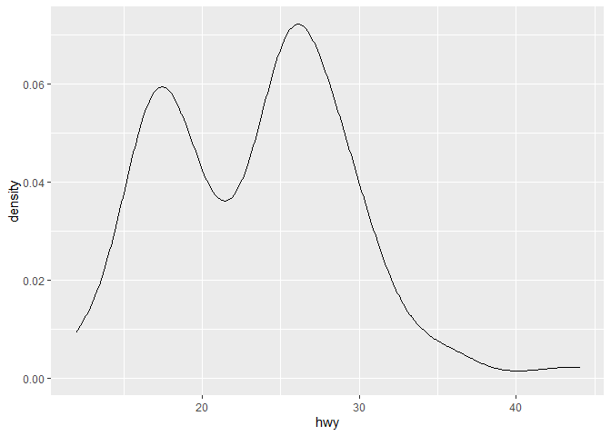
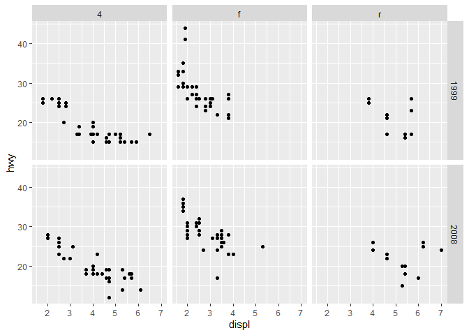
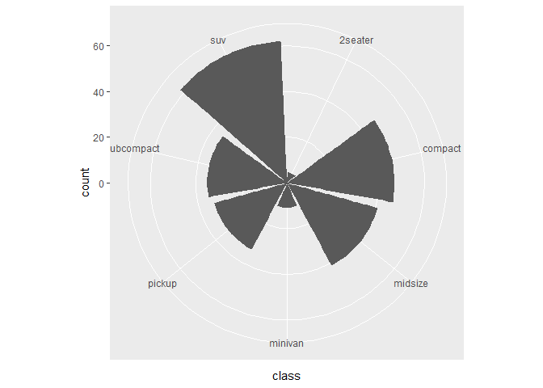
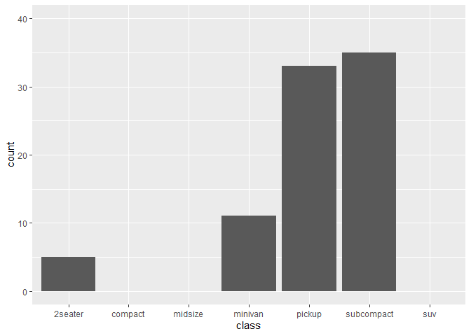

Introduction to the Tidyverse
================
Alejandro Gil-Gomez
4/24/2020

## Overview from tidyverse website

The tidyverse is a set of packages that work in harmony because they
share common data representations and API design. The tidyverse package
is designed to make it easy to install and load core packages from the
tidyverse in a single command.

If you’d like to learn how to use the tidyverse effectively, the best
place to start is [R for data science](https://r4ds.had.co.nz/).

## Usage

library(tidyverse) will load the core tidyverse packages:

  - **ggplot2**, for data visualisation.
  - **dplyr**, for data manipulation.
  - **tidyr**, for data tidying.
  - **readr**, for data import.
  - **purrr**, for functional programming.
  - **tibble**, for tibbles, a modern re-imagining of data frames.
  - **stringr**, for strings.
  - **forcats**, for factors.

## Packages

As well as the core tidyverse, installing this package also installs a
selection of other packages that you’re likely to use frequently, but
probably not in every analysis. This includes packages for:

  - Working with specific types of vectors:
    
      - **hms**, for times.
      - **lubridate**, for date/times.

  - Importing other types of data:
    
      - **feather**, for sharing with Python and other languages.
      - **haven**, for SPSS, SAS and Stata files.
      - **httr**, for web apis.
      - **jsonlite** for JSON.
      - **readxl**, for .xls and .xlsx files.
      - **rvest**, for web scraping. xml2, for XML.

  - Modelling
    
      - **modelr**, for modelling within a pipeline
      - **broom**, for turning models into tidy data

## The packages I use the most are:

  - dplyr
  - readr
  - tidyr
  - ggplot2
  - purrr
  - broom

### Let’s take a look

``` r
knitr::opts_knit$set(root.dir = 'C:/Users/alexg/Google Drive/05-Proyectos/restlab_workshop/02-AlejandroGil-Tidyverse/')

#If you want to convert this Rmarkdown document into an R script. Run the following.
#knitr::purl("pathtofile/file.Rmd",documentation=2)

#Or setwd() 
#setwd('C:/Users/alexg/Google Drive/05-Proyectos/restlab_workshop/02-AlejandroGil-Tidyverse/')
```

``` r
#Install the tidyverse if you haven't already.
#install.packages("tidyverse")
library(tidyverse)
```

    ## -- Attaching packages ------------------------------- tidyverse 1.3.0 --

    ## v ggplot2 3.3.0     v purrr   0.3.3
    ## v tibble  2.1.3     v dplyr   0.8.5
    ## v tidyr   1.0.2     v stringr 1.4.0
    ## v readr   1.3.1     v forcats 0.5.0

    ## -- Conflicts ---------------------------------- tidyverse_conflicts() --
    ## x dplyr::filter() masks stats::filter()
    ## x dplyr::lag()    masks stats::lag()

### Readr

Readr is a package that allow us to load data into R. It is very similar
to function you probably use already such as read\_csv(). The main
difference is that it can collect info from the type of the data in each
column automatically.

Let’s compare the two:

``` r
#Base R
base_tab <- read.csv("data/iris.csv")
base_tab %>% head()
```

    ##   Sepal.Length Sepal.Width Petal.Length Petal.Width Species
    ## 1          5.1         3.5          1.4         0.2  setosa
    ## 2          4.9         3.0          1.4         0.2  setosa
    ## 3          4.7         3.2          1.3         0.2  setosa
    ## 4          4.6         3.1          1.5         0.2  setosa
    ## 5          5.0         3.6          1.4         0.2  setosa
    ## 6          5.4         3.9          1.7         0.4  setosa

``` r
#readR
tidy_tab <- read_csv("data/iris.csv")
```

    ## Parsed with column specification:
    ## cols(
    ##   Sepal.Length = col_double(),
    ##   Sepal.Width = col_double(),
    ##   Petal.Length = col_double(),
    ##   Petal.Width = col_double(),
    ##   Species = col_character()
    ## )

``` r
tidy_tab %>% head()
```

    ## # A tibble: 6 x 5
    ##   Sepal.Length Sepal.Width Petal.Length Petal.Width Species
    ##          <dbl>       <dbl>        <dbl>       <dbl> <chr>  
    ## 1          5.1         3.5          1.4         0.2 setosa 
    ## 2          4.9         3            1.4         0.2 setosa 
    ## 3          4.7         3.2          1.3         0.2 setosa 
    ## 4          4.6         3.1          1.5         0.2 setosa 
    ## 5          5           3.6          1.4         0.2 setosa 
    ## 6          5.4         3.9          1.7         0.4 setosa

Readr supports these formats

  - read\_csv(): comma separated (CSV) files
  - read\_tsv(): tab separated files
  - read\_delim(): general delimited files
  - read\_fwf(): fixed width files
  - read\_table(): tabular files where columns are separated by
    white-space.
  - read\_log(): web log files

It is faster than base R, and it lets you see errors during the
importation.

**%\>%**: The pipe operator connects tidyverse functions. Contrl+Shift+M

tidy\_tab %\>% head()

instead of

head(iris)

**tible**: This is the format of the dataframes the tidyverse uses:

``` r
base_tab %>%
  class()
```

    ## [1] "data.frame"

``` r
tidy_tab %>%
  class()
```

    ## [1] "spec_tbl_df" "tbl_df"      "tbl"         "data.frame"

Learn more about [readr](https://readr.tidyverse.org/).

### Tidyr

This package is used for data tidying.

The most useful functions from this package are gather() and spread().

``` r
#Take a loot at this data.frame. 
stocks <- data.frame(
  time = as.Date('2009-01-01') + 0:9,
  X = rnorm(10, 0, 1),
  Y = rnorm(10, 0, 2),
  Z = rnorm(10, 0, 4))
#Sometimes we need to organize the data in a different way in order to plot it or perform some analysis.
#Imagine we want to represent two variables called specification and value for columns 1:5 and represent it in a tidydata. We can use the function gather.
stock_narrow <- stocks %>%
  gather(stock, price, -time)

stock_narrow %>% 
  head()
```

    ##         time stock       price
    ## 1 2009-01-01     X  0.09304331
    ## 2 2009-01-02     X -1.23627983
    ## 3 2009-01-03     X  0.57432018
    ## 4 2009-01-04     X -0.89688752
    ## 5 2009-01-05     X  0.25868611
    ## 6 2009-01-06     X  0.55922224

``` r
#We can also do the opposite to gather, which is spread. This convert our narrow-data into wide date.
stock_wide <- stock_narrow %>%
  spread(stock, price)

stock_wide %>% 
  head()
```

    ##         time           X           Y          Z
    ## 1 2009-01-01  0.09304331  0.32562299  5.3741133
    ## 2 2009-01-02 -1.23627983  0.04877666  4.1456364
    ## 3 2009-01-03  0.57432018 -2.25364323  3.8041776
    ## 4 2009-01-04 -0.89688752 -1.03676267 -0.1473568
    ## 5 2009-01-05  0.25868611  1.13006273  2.4748264
    ## 6 2009-01-06  0.55922224  2.40886309  3.5119962

There are other functions to tidy-up our data in this package, such as
separate, this separate a column into multiple columns if they are
separated by a character. Learn more about
[tidyr](https://tidyr.tidyverse.org/).

### Dplyr

This package is used for data manipulation. It contains several great
functions.

``` r
mpg %>% 
  head()
```

    ## # A tibble: 6 x 11
    ##   manufacturer model displ  year   cyl trans      drv     cty   hwy fl    class 
    ##   <chr>        <chr> <dbl> <int> <int> <chr>      <chr> <int> <int> <chr> <chr> 
    ## 1 audi         a4      1.8  1999     4 auto(l5)   f        18    29 p     compa~
    ## 2 audi         a4      1.8  1999     4 manual(m5) f        21    29 p     compa~
    ## 3 audi         a4      2    2008     4 manual(m6) f        20    31 p     compa~
    ## 4 audi         a4      2    2008     4 auto(av)   f        21    30 p     compa~
    ## 5 audi         a4      2.8  1999     6 auto(l5)   f        16    26 p     compa~
    ## 6 audi         a4      2.8  1999     6 manual(m5) f        18    26 p     compa~

These are the some of the most useful:

  - rename() This is used to rename columns.

<!-- end list -->

``` r
mpg %>% 
  rename(company = manufacturer,
         cyllinders = cyl)
```

    ## # A tibble: 234 x 11
    ##    company model    displ  year cyllinders trans   drv     cty   hwy fl    class
    ##    <chr>   <chr>    <dbl> <int>      <int> <chr>   <chr> <int> <int> <chr> <chr>
    ##  1 audi    a4         1.8  1999          4 auto(l~ f        18    29 p     comp~
    ##  2 audi    a4         1.8  1999          4 manual~ f        21    29 p     comp~
    ##  3 audi    a4         2    2008          4 manual~ f        20    31 p     comp~
    ##  4 audi    a4         2    2008          4 auto(a~ f        21    30 p     comp~
    ##  5 audi    a4         2.8  1999          6 auto(l~ f        16    26 p     comp~
    ##  6 audi    a4         2.8  1999          6 manual~ f        18    26 p     comp~
    ##  7 audi    a4         3.1  2008          6 auto(a~ f        18    27 p     comp~
    ##  8 audi    a4 quat~   1.8  1999          4 manual~ 4        18    26 p     comp~
    ##  9 audi    a4 quat~   1.8  1999          4 auto(l~ 4        16    25 p     comp~
    ## 10 audi    a4 quat~   2    2008          4 manual~ 4        20    28 p     comp~
    ## # ... with 224 more rows

  - select() This function selects a group of columns. You can also
    select by index.

<!-- end list -->

``` r
mpg %>% 
  select(model,year,trans)
```

    ## # A tibble: 234 x 3
    ##    model       year trans     
    ##    <chr>      <int> <chr>     
    ##  1 a4          1999 auto(l5)  
    ##  2 a4          1999 manual(m5)
    ##  3 a4          2008 manual(m6)
    ##  4 a4          2008 auto(av)  
    ##  5 a4          1999 auto(l5)  
    ##  6 a4          1999 manual(m5)
    ##  7 a4          2008 auto(av)  
    ##  8 a4 quattro  1999 manual(m5)
    ##  9 a4 quattro  1999 auto(l5)  
    ## 10 a4 quattro  2008 manual(m6)
    ## # ... with 224 more rows

  - filter()

<!-- end list -->

``` r
mpg %>% 
  filter(cyl>5, manufacturer=="audi")
```

    ## # A tibble: 10 x 11
    ##    manufacturer model    displ  year   cyl trans   drv     cty   hwy fl    class
    ##    <chr>        <chr>    <dbl> <int> <int> <chr>   <chr> <int> <int> <chr> <chr>
    ##  1 audi         a4         2.8  1999     6 auto(l~ f        16    26 p     comp~
    ##  2 audi         a4         2.8  1999     6 manual~ f        18    26 p     comp~
    ##  3 audi         a4         3.1  2008     6 auto(a~ f        18    27 p     comp~
    ##  4 audi         a4 quat~   2.8  1999     6 auto(l~ 4        15    25 p     comp~
    ##  5 audi         a4 quat~   2.8  1999     6 manual~ 4        17    25 p     comp~
    ##  6 audi         a4 quat~   3.1  2008     6 auto(s~ 4        17    25 p     comp~
    ##  7 audi         a4 quat~   3.1  2008     6 manual~ 4        15    25 p     comp~
    ##  8 audi         a6 quat~   2.8  1999     6 auto(l~ 4        15    24 p     mids~
    ##  9 audi         a6 quat~   3.1  2008     6 auto(s~ 4        17    25 p     mids~
    ## 10 audi         a6 quat~   4.2  2008     8 auto(s~ 4        16    23 p     mids~

  - mutate(). This calculates new columns from existing ones. Use
    transmute if you want only to keep the new calculated columns.

<!-- end list -->

``` r
mpg %>% 
  mutate(cty_hwy=cty*hwy)
```

    ## # A tibble: 234 x 12
    ##    manufacturer model displ  year   cyl trans drv     cty   hwy fl    class
    ##    <chr>        <chr> <dbl> <int> <int> <chr> <chr> <int> <int> <chr> <chr>
    ##  1 audi         a4      1.8  1999     4 auto~ f        18    29 p     comp~
    ##  2 audi         a4      1.8  1999     4 manu~ f        21    29 p     comp~
    ##  3 audi         a4      2    2008     4 manu~ f        20    31 p     comp~
    ##  4 audi         a4      2    2008     4 auto~ f        21    30 p     comp~
    ##  5 audi         a4      2.8  1999     6 auto~ f        16    26 p     comp~
    ##  6 audi         a4      2.8  1999     6 manu~ f        18    26 p     comp~
    ##  7 audi         a4      3.1  2008     6 auto~ f        18    27 p     comp~
    ##  8 audi         a4 q~   1.8  1999     4 manu~ 4        18    26 p     comp~
    ##  9 audi         a4 q~   1.8  1999     4 auto~ 4        16    25 p     comp~
    ## 10 audi         a4 q~   2    2008     4 manu~ 4        20    28 p     comp~
    ## # ... with 224 more rows, and 1 more variable: cty_hwy <int>

  - count()

<!-- end list -->

``` r
mpg %>% 
  count(model)
```

    ## # A tibble: 38 x 2
    ##    model                  n
    ##    <chr>              <int>
    ##  1 4runner 4wd            6
    ##  2 a4                     7
    ##  3 a4 quattro             8
    ##  4 a6 quattro             3
    ##  5 altima                 6
    ##  6 c1500 suburban 2wd     5
    ##  7 camry                  7
    ##  8 camry solara           7
    ##  9 caravan 2wd           11
    ## 10 civic                  9
    ## # ... with 28 more rows

  - arrange()

<!-- end list -->

``` r
mpg %>% 
  filter(manufacturer=="audi")%>% 
  arrange(cyl)
```

    ## # A tibble: 18 x 11
    ##    manufacturer model    displ  year   cyl trans   drv     cty   hwy fl    class
    ##    <chr>        <chr>    <dbl> <int> <int> <chr>   <chr> <int> <int> <chr> <chr>
    ##  1 audi         a4         1.8  1999     4 auto(l~ f        18    29 p     comp~
    ##  2 audi         a4         1.8  1999     4 manual~ f        21    29 p     comp~
    ##  3 audi         a4         2    2008     4 manual~ f        20    31 p     comp~
    ##  4 audi         a4         2    2008     4 auto(a~ f        21    30 p     comp~
    ##  5 audi         a4 quat~   1.8  1999     4 manual~ 4        18    26 p     comp~
    ##  6 audi         a4 quat~   1.8  1999     4 auto(l~ 4        16    25 p     comp~
    ##  7 audi         a4 quat~   2    2008     4 manual~ 4        20    28 p     comp~
    ##  8 audi         a4 quat~   2    2008     4 auto(s~ 4        19    27 p     comp~
    ##  9 audi         a4         2.8  1999     6 auto(l~ f        16    26 p     comp~
    ## 10 audi         a4         2.8  1999     6 manual~ f        18    26 p     comp~
    ## 11 audi         a4         3.1  2008     6 auto(a~ f        18    27 p     comp~
    ## 12 audi         a4 quat~   2.8  1999     6 auto(l~ 4        15    25 p     comp~
    ## 13 audi         a4 quat~   2.8  1999     6 manual~ 4        17    25 p     comp~
    ## 14 audi         a4 quat~   3.1  2008     6 auto(s~ 4        17    25 p     comp~
    ## 15 audi         a4 quat~   3.1  2008     6 manual~ 4        15    25 p     comp~
    ## 16 audi         a6 quat~   2.8  1999     6 auto(l~ 4        15    24 p     mids~
    ## 17 audi         a6 quat~   3.1  2008     6 auto(s~ 4        17    25 p     mids~
    ## 18 audi         a6 quat~   4.2  2008     8 auto(s~ 4        16    23 p     mids~

  - group\_by() and summarise()

<!-- end list -->

``` r
mpg %>% 
  group_by(manufacturer,model) %>% 
  summarise(mean_cyl=mean(cyl),
            sd_cyl=sd(cyl))
```

    ## # A tibble: 38 x 4
    ## # Groups:   manufacturer [15]
    ##    manufacturer model              mean_cyl sd_cyl
    ##    <chr>        <chr>                 <dbl>  <dbl>
    ##  1 audi         a4                     4.86  1.07 
    ##  2 audi         a4 quattro             5     1.07 
    ##  3 audi         a6 quattro             6.67  1.15 
    ##  4 chevrolet    c1500 suburban 2wd     8     0    
    ##  5 chevrolet    corvette               8     0    
    ##  6 chevrolet    k1500 tahoe 4wd        8     0    
    ##  7 chevrolet    malibu                 5.2   1.10 
    ##  8 dodge        caravan 2wd            5.82  0.603
    ##  9 dodge        dakota pickup 4wd      7.11  1.05 
    ## 10 dodge        durango 4wd            7.71  0.756
    ## # ... with 28 more rows

Learn more about [dplyr](https://dplyr.tidyverse.org/).

### Ggplot2

Ggplot2 is used for data visualization. It is based in the grammar of
graphics. If you want to be a master of ggplot, you should watch the
videos by Thomas Lin Pedersen.

[Intro To ggplot 2](https://www.youtube.com/watch?v=h29g21z0a68) This
video will show you the grammar of graphics and an introduction to
ggplot2. The code below was used by Thomas Lin Pedersen in his online
seminar.

### Datasets

We will use an assortment of datasets throughout the document. The
purpose is mostly to showcase different plots, and less on getting some
divine insight into the world. While not necessary we will call
`data(<dataset>)` before using a new dataset to indicate the
introduction of a new dataset.

## Introduction

We will look at the basic ggplot2 use using the faithful dataset, giving
information on the eruption pattern of the Old Faithful geyser in
Yellowstone National Park.

``` r
data("faithful")
# Basic scatterplot
ggplot(data = faithful, 
       mapping = aes(x = eruptions, y = waiting)) + 
  geom_point()
```

<!-- -->

``` r
# Data and mapping can be given both as global (in ggplot()) or per layer
ggplot() + 
  geom_point(mapping = aes(x = eruptions, y = waiting),
             data = faithful)
```

<!-- -->

If an aesthetic is linked to data it is put into `aes()`

``` r
ggplot(faithful) + 
  geom_point(aes(x = eruptions, y = waiting, colour = eruptions < 3))
```

<!-- -->

If you simple want to set it to a value, put it outside of `aes()`

``` r
ggplot(faithful) + 
  geom_point(aes(x = eruptions, y = waiting),
             colour = 'steelblue')
```

<!-- -->

Some geoms only need a single mapping and will calculate the rest for
you

``` r
ggplot(faithful) + 
  geom_histogram(aes(x = eruptions))
```

    ## `stat_bin()` using `bins = 30`. Pick better value with `binwidth`.

<!-- -->

geoms are drawn in the order they are added. The point layer is thus
drawn on top of the density contours in the example below.

``` r
ggplot(faithful, aes(x = eruptions, y = waiting)) + 
  geom_density_2d() + 
  geom_point()
```

<!-- -->

#### Exercise

Modify the code below to make the points larger squares and slightly
transparent. See `?geom_point` for more information on the point layer.

``` r
ggplot(faithful) + 
  geom_point(aes(x = eruptions, y = waiting))
```

<!-- -->

Hint 1: transparency is controlled with `alpha`, and shape with `shape`
Hint 2: rememberthe difference between mapping and setting aesthetics

-----

Colour the two distributions in the histogram with different colours

``` r
ggplot(faithful) + 
  geom_histogram(aes(x = eruptions))
```

    ## `stat_bin()` using `bins = 30`. Pick better value with `binwidth`.

<!-- -->

Hint 1: For polygons you can map two different colour-like aesthetics:
`colour` (the colour of the stroke) and `fill` (the fill colour)

-----

Colour the distributions in the histogram by whether `waiting` is above
or below `60`. What happens?

``` r
ggplot(faithful) + 
  geom_histogram(aes(x = eruptions))
```

    ## `stat_bin()` using `bins = 30`. Pick better value with `binwidth`.

<!-- -->

Change the plot above by setting `position = 'dodge'` in
`geom_histogram()` (while keeping the colouring by `waiting`). What do
`position` control?

-----

Add a line that separates the two point distributions. See
`?geom_abline` for how to draw straight lines from a slope and
intercept.

``` r
ggplot(faithful) + 
  geom_point(aes(x = eruptions, y = waiting))
```

<!-- -->

### Stat

We will use the `mpg` dataset giving information about fuel economy on
different car models.

Every geom has a stat. This is why new data (`count`) can appear when
using `geom_bar()`.

``` r
data("mpg")
ggplot(mpg) + 
  geom_bar(aes(x = class))
```

<!-- -->

The stat can be overwritten. If we have precomputed count we don’t want
any additional computations to perform and we use the `identity` stat to
leave the data alone

``` r
library(dplyr)
mpg_counted <- mpg %>% 
  count(class, name = 'count')
ggplot(mpg_counted) + 
  geom_bar(aes(x = class, y = count), stat = 'identity')
```

<!-- -->

Most obvious geom+stat combinations have a dedicated geom constructor.
The one above is available directly as `geom_col()`

``` r
ggplot(mpg_counted) + 
  geom_col(aes(x = class, y = count))
```

<!-- -->

Values calculated by the stat is available with the `after_stat()`
function inside `aes()`. You can do all sorts of computations inside
that.

``` r
ggplot(mpg) + 
  geom_bar(aes(x = class, y = after_stat(100 * count / sum(count))))
```

<!-- -->

Many stats provide multiple variations of the same calculation, and
provides a default (here, `density`)

``` r
ggplot(mpg) + 
  geom_density(aes(x = hwy))
```

<!-- -->

While the others must be used with the `after_stat()` function

``` r
ggplot(mpg) + 
  geom_density(aes(x = hwy, y = after_stat(scaled)))
```

<!-- -->

#### Exercises

While most people use `geom_*()` when adding layers, it is just as valid
to add a `stat_*()` with an attached geom. Look at `geom_bar()` and
figure out which stat it uses as default. Then modify the code to use
the stat directly instead (i.e. adding `stat_*()` instead of
`geom_bar()`)

``` r
ggplot(mpg) + 
  geom_bar(aes(x = class))
```

<!-- -->

-----

Use `stat_summary()` to add a red dot at the mean `hwy` for each group

``` r
ggplot(mpg) + 
  geom_jitter(aes(x = class, y = hwy), width = 0.2)
```

<!-- -->

Hint: You will need to change the default geom of `stat_summary()`

### Scales

Scales define how the mapping you specify inside `aes()` should happen.
All mappings have an associated scale even if not specified.

``` r
ggplot(mpg) + 
  geom_point(aes(x = displ, y = hwy, colour = class))
```

<!-- -->

take control by adding one explicitly. All scales follow the same naming
conventions.

``` r
ggplot(mpg) + 
  geom_point(aes(x = displ, y = hwy, colour = class)) + 
  scale_colour_brewer(type = 'qual')
```

<!-- -->

Positional mappings (x and y) also have associated scales.

``` r
ggplot(mpg) + 
  geom_point(aes(x = displ, y = hwy)) + 
  scale_x_continuous(breaks = c(3, 5, 6)) + 
  scale_y_continuous(trans = 'log10')
```

<!-- -->

#### Exercises

Use `RColorBrewer::display.brewer.all()` to see all the different
palettes from Color Brewer and pick your favourite. Modify the code
below to use it

``` r
ggplot(mpg) + 
  geom_point(aes(x = displ, y = hwy, colour = class)) + 
  scale_colour_brewer(type = 'qual')
```

<!-- -->

-----

Modify the code below to create a bubble chart (scatterplot with size
mapped to a continuous variable) showing `cyl` with size. Make sure that
only the present amount of cylinders (4, 5, 6, and 8) are present in the
legend.

``` r
ggplot(mpg) + 
  geom_point(aes(x = displ, y = hwy, colour = class, size = cyl)) + 
  scale_colour_brewer(type = 'qual') + 
  scale_size_area(breaks = c(4, 5, 6, 8))
```

<!-- -->

Hint: The `breaks` argument in the scale is used to control which values
are present in the legend.

Explore the different types of size scales available in ggplot2. Is the
default the most appropriate here?

-----

Modify the code below so that colour is no longer mapped to the discrete
`class` variable, but to the continuous `cty` variable. What happens to
the guide?

``` r
ggplot(mpg) + 
  geom_point(aes(x = displ, y = hwy, colour = class, size = cty))
```

<!-- -->

-----

The type of guide can be controlled with the `guide` argument in the
scale, or with the `guides()` function. Continuous colours have a
gradient colour bar by default, but setting it to `legend` will turn it
back to the standard look. What happens when multiple aesthetics are
mapped to the same variable and uses the guide type?

``` r
ggplot(mpg) + 
  geom_point(aes(x = displ, y = hwy, colour = cty, size = cty))
```

<!-- -->

### Facets

The facet defines how data is split among panels. The default facet
(`facet_null()`) puts all the data in a single panel, while
`facet_wrap()` and `facet_grid()` allows you to specify different types
of small multiples

``` r
ggplot(mpg) + 
  geom_point(aes(x = displ, y = hwy)) + 
  facet_wrap(~ class)
```

<!-- -->

``` r
ggplot(mpg) + 
  geom_point(aes(x = displ, y = hwy)) + 
  facet_grid(year ~ drv)
```

<!-- -->

#### Exercises

One of the great things about facets is that they share the axes between
the different panels. Sometimes this is undiserable though, and the
behaviour can be changed with the `scales` argument. Experiment with the
different possible settings in the plot below:

``` r
ggplot(mpg) + 
  geom_point(aes(x = displ, y = hwy)) + 
  facet_wrap(~ drv)
```

<!-- -->

-----

Usually the space occupied by each panel is equal. This can create
problems when different scales are used. Modify the code below so that
the y scale differs between the panels in the plot. What happens?

``` r
ggplot(mpg) + 
  geom_bar(aes(y = manufacturer)) + 
  facet_grid(class ~ .)
```

<!-- -->

Use the `space` argument in `facet_grid()` to change the plot above so
each bar has the same width again.

-----

Facets can be based on multiple variables by adding them together. Try
to recreate the same panels present in the plot below by using
`facet_wrap()`

``` r
ggplot(mpg) + 
  geom_point(aes(x = displ, y = hwy)) + 
  facet_grid(year ~ drv)
```

<!-- -->

### Coordinates

The coordinate system is the fabric you draw your layers on in the end.
The default \`coord\_cartesion provides the standard rectangular x-y
coordinate system. Changing the coordinate system can have dramatic
effects

``` r
ggplot(mpg) + 
  geom_bar(aes(x = class)) + 
  coord_polar()
```

<!-- -->

``` r
ggplot(mpg) + 
  geom_bar(aes(x = class)) + 
  coord_polar(theta = 'y') + 
  expand_limits(y = 70)
```

<!-- -->

You can zoom both on the scale…

``` r
ggplot(mpg) + 
  geom_bar(aes(x = class)) + 
  scale_y_continuous(limits = c(0, 40))
```

    ## Warning: Removed 3 rows containing missing values (geom_bar).

<!-- -->

and in the coord. You usually want the latter as it avoids changing the
plottet data

``` r
ggplot(mpg) + 
  geom_bar(aes(x = class)) + 
  coord_cartesian(ylim = c(0, 40))
```

<!-- -->

#### Exercises

In the same way as limits can be set in both the positional scale and
the coord, so can transformations, using `coord_trans()`. Modify the
code below to apply a log transformation to the y axis; first using
`scale_y_continuous()`, and then using `coord_trans()`. Compare the
results — how do they differ?

``` r
ggplot(mpg) + 
  geom_point(aes(x = hwy, y = displ))
```

<!-- -->

-----

Coordinate systems are particularly important in cartography. While we
will not spend a lot of time with it in this workshop, spatial plotting
is well supported in ggplot2 with `geom_sf()` and `coord_sf()` (which
interfaces with the sf package). The code below produces a world map.
Try changing the `crs` argument in `coord_sf()` to be `'+proj=robin'`
(This means using the Robinson projection).

``` r
# Get the borders of all countries
world <- sf::st_as_sf(maps::map('world', plot = FALSE, fill = TRUE))
world <- sf::st_wrap_dateline(world, 
                              options = c("WRAPDATELINE=YES", "DATELINEOFFSET=180"),
                              quiet = TRUE)
```

    ## Warning in CPL_wrap_dateline(st_geometry(x), options, quiet): GDAL Error 1:
    ## IllegalArgumentException: Points of LinearRing do not form a closed linestring
    
    ## Warning in CPL_wrap_dateline(st_geometry(x), options, quiet): GDAL Error 1:
    ## IllegalArgumentException: Points of LinearRing do not form a closed linestring

``` r
# Plot code
ggplot(world) + 
  geom_sf() + 
  coord_sf(crs = "+proj=moll")
```

<!-- -->

Maps are a huge area in data visualisation and simply too big to cover
in this workshop. If you want to explore further I advice you to explore
the [r-spatial wbsite](https://www.r-spatial.org) as well as the website
for the [sf package](https://r-spatial.github.io/sf)

### Theme

Theming defines the feel and look of your final visualisation and is
something you will normally defer to the final polishing of the plot. It
is very easy to change looks with a prebuild theme

``` r
ggplot(mpg) + 
  geom_bar(aes(y = class)) + 
  facet_wrap(~year) + 
  theme_minimal()
```

<!-- -->

Further adjustments can be done in the end to get exactly the look you
want

``` r
ggplot(mpg) + 
  geom_bar(aes(y = class)) + 
  facet_wrap(~year) + 
  labs(title = "Number of car models per class",
       caption = "source: http://fueleconomy.gov",
       x = NULL,
       y = NULL) +
  scale_x_continuous(expand = c(0, NA)) + 
  theme_minimal() + 
  theme(
    text = element_text('Avenir Next Condensed'),
    strip.text = element_text(face = 'bold', hjust = 0),
    plot.caption = element_text(face = 'italic'),
    panel.grid.major = element_line('white', size = 0.5),
    panel.grid.minor = element_blank(),
    panel.grid.major.y = element_blank(),
    panel.ontop = TRUE
  )
```

    ## Warning in grid.Call(C_stringMetric, as.graphicsAnnot(x$label)): font family not
    ## found in Windows font database

    ## Warning in grid.Call(C_textBounds, as.graphicsAnnot(x$label), x$x, x$y, : font
    ## family not found in Windows font database
    
    ## Warning in grid.Call(C_textBounds, as.graphicsAnnot(x$label), x$x, x$y, : font
    ## family not found in Windows font database

    ## Warning in grid.Call(C_stringMetric, as.graphicsAnnot(x$label)): font family not
    ## found in Windows font database

    ## Warning in grid.Call(C_textBounds, as.graphicsAnnot(x$label), x$x, x$y, : font
    ## family not found in Windows font database
    
    ## Warning in grid.Call(C_textBounds, as.graphicsAnnot(x$label), x$x, x$y, : font
    ## family not found in Windows font database
    
    ## Warning in grid.Call(C_textBounds, as.graphicsAnnot(x$label), x$x, x$y, : font
    ## family not found in Windows font database

    ## Warning in grid.Call.graphics(C_text, as.graphicsAnnot(x$label), x$x, x$y, :
    ## font family not found in Windows font database

    ## Warning in grid.Call(C_textBounds, as.graphicsAnnot(x$label), x$x, x$y, : font
    ## family not found in Windows font database
    
    ## Warning in grid.Call(C_textBounds, as.graphicsAnnot(x$label), x$x, x$y, : font
    ## family not found in Windows font database
    
    ## Warning in grid.Call(C_textBounds, as.graphicsAnnot(x$label), x$x, x$y, : font
    ## family not found in Windows font database

<!-- -->

#### Exercises

Themes can be overwhelming, especially as you often try to optimise for
beauty while you learn. To remove the last part of the equation, the
exercise is to take the plot given below and make it as hideous as
possible using the theme function. Go absolutely crazy, but take note of
the effect as you change different settings.

``` r
ggplot(mpg) + 
  geom_bar(aes(y = class, fill = drv)) + 
  facet_wrap(~year) + 
  labs(title = "Number of car models per class",
       caption = "source: http://fueleconomy.gov",
       x = 'Number of cars',
       y = NULL)
```

<!-- -->

Learn more about [ggplot2](https://ggplot2.tidyverse.org/)

## Extended ggplot

[Extended packages](https://www.youtube.com/watch?v=0m4yywqNPVY) This
video will show you other packages associated with ggplot

### Plot composition

We start by creating 3 separate plots

``` r
p1 <- ggplot(msleep) + 
  geom_boxplot(aes(x = sleep_total, y = vore, fill = vore))
p1
```

<!-- -->

``` r
p2 <- ggplot(msleep) + 
  geom_bar(aes(y = vore, fill = vore))
p2
```

<!-- -->

``` r
p3 <- ggplot(msleep) + 
  geom_point(aes(x = bodywt, y = sleep_total, colour = vore)) + 
  scale_x_log10()
p3
```

<!-- -->

Combining them with patchwork is a breeze using the different operators

``` r
library(patchwork)
p1 + p2 + p3
```

<!-- -->

``` r
(p1 | p2) / 
   p3
```

<!-- -->

``` r
p_all <- (p1 | p2) / 
            p3
p_all + plot_layout(guides = 'collect')
```

<!-- -->

``` r
p_all & theme(legend.position = 'none')
```

<!-- -->

``` r
p_all <- p_all & theme(legend.position = 'none')
p_all + plot_annotation(
  title = 'Mammalian sleep patterns',
  tag_levels = 'A'
)
```

<!-- -->

#### Excercises

Patchwork will assign the same amount of space to each plot by default,
but this can be controlled with the `widths` and `heights` argument in
`plot_layout()`. This can take a numeric vector giving their relative
sizes (e.g. `c(2, 1)` will make the first plot twice as big as the
second). Modify the code below so that the middle plot takes up half of
the total space:

``` r
p <- ggplot(mtcars) + 
  geom_point(aes(x = disp, y = mpg))
p + p + p
```

<!-- -->

-----

The `&` operator can be used with any type of ggplot2 object, not just
themes. Modify the code below so the two plots share the same y-axis
(same limits)

``` r
p1 <- ggplot(mtcars[mtcars$gear == 3,]) + 
  geom_point(aes(x = disp, y = mpg))
p2 <- ggplot(mtcars[mtcars$gear == 4,]) + 
  geom_point(aes(x = disp, y = mpg))
p1 + p2
```

<!-- -->

-----

Patchwork contains many features for fine tuning the layout and
annotation. Very complex layouts can be obtained by providing a design
specification to the `design` argument in `plot_layout()`. The design
can be defined as a textual representation of the cells. Use the layout
given below. How should the textual representation be undertood.

``` r
p1 <- ggplot(mtcars) + 
  geom_point(aes(x = disp, y = mpg))
p2 <- ggplot(mtcars) + 
  geom_bar(aes(x = factor(gear)))
p3 <- ggplot(mtcars) + 
  geom_boxplot(aes(x = factor(gear), y = mpg))
layout <- '
AA#
#BB
C##
'
p1 + p2 + p3 + plot_layout(design = layout)
```

<!-- -->

### Animation

ggplot2 is usually focused on static plots, but gganimate extends the
API and grammar to describe animations. As such it feels like a very
natural extension of using ggplot2

``` r
ggplot(economics) + 
  geom_line(aes(x = date, y = unemploy))
```

<!-- -->

``` r
library(gganimate)
ggplot(economics) + 
  geom_line(aes(x = date, y = unemploy)) + 
  transition_reveal(along = date)
```

<!-- -->

There are many different transitions that control how data is
interpreted for animation, as well as a range of other animation
specific features

``` r
ggplot(mpg) + 
  geom_bar(aes(x = factor(cyl)))
```

<!-- -->

``` r
ggplot(mpg) + 
  geom_bar(aes(x = factor(cyl))) + 
  labs(title = 'Number of cars in {closest_state} by number of cylinders') + 
  transition_states(states = year) + 
  enter_grow() + 
  exit_fade()
```

<!-- -->

#### Exercises

The animation below will animate between points showing cars with
different cylinders.

``` r
ggplot(mpg) + 
  geom_point(aes(x = displ, y = hwy)) + 
  ggtitle("Cars with {closest_state} cylinders") + 
  transition_states(factor(cyl))
```

<!-- -->

gganimate uses the `group` aesthetic to match observations between
states. By default the group aesthetic is set to the same value, so
observations are matched by their position (first row of 4 cyl is
matched to first row of 5 cyl etc.). This is clearly wrong here (why?).
Add a mapping to the `group` aesthetic to ensure that points do not move
between the different states.

-----

In the presence of discrete aesthetic mappings (`colour` below), the
group is deduced if not given. The default behaviour of objects that
appear and disappear during the animation is to simply pop in and out of
existance. `enter_*()` and `exit_*()` functions can be used to control
this behaviour. Experiment with the different enter and exit functions
provided by gganimate below. What happens if you add multiple enter or
exit functions to the same animation?

``` r
ggplot(mpg) + 
  geom_point(aes(x = displ, y = hwy, colour = factor(cyl))) + 
  ggtitle("Cars with {closest_state} cylinders") + 
  transition_states(factor(cyl))
```

<!-- -->

-----

In the animation below (as in all the other animations) the changes
happens at constant speed. How values change during an animation is
called easing and can be controlled using the `ease_aes()` function.
Read the documentation for `ease_aes()` and experiment with different
easings in the animation.

``` r
mpg2 <- tidyr::pivot_longer(mpg, c(cty,hwy))
ggplot(mpg2) + 
  geom_point(aes(x = displ, y = value)) + 
  ggtitle("{if (closest_state == 'cty') 'Efficiency in city' else 'Efficiency on highway'}") + 
  transition_states(name)
```

<!-- -->

### Annotation

Text is a huge part of storytelling with your visualisation.
Historically, textual annotations has not been the best part of ggplot2
but new extensions make up for that.

Standard geom\_text will often result in overlaping labels

``` r
ggplot(mtcars, aes(x = disp, y = mpg)) + 
  geom_point() + 
  geom_text(aes(label = row.names(mtcars)))
```

<!-- -->

ggrepel takes care of that

``` r
library(ggrepel)
ggplot(mtcars, aes(x = disp, y = mpg)) + 
  geom_point() + 
  geom_text_repel(aes(label = row.names(mtcars)))
```

<!-- -->

If you want to highlight certain parts of your data and describe it, the
`geom_mark_*()` family of geoms have your back

``` r
library(ggforce)
ggplot(mtcars, aes(x = disp, y = mpg)) +
  geom_point() + 
  geom_mark_ellipse(aes(filter = gear == 4,
                        label = '4 gear cars',
                        description = 'Cars with fewer gears tend to both have higher yield and lower displacement'))
```

<!-- -->

#### Exercises

ggrepel has a tonne of settings for controlling how text labels move.
Often, though, the most effective is simply to not label everything.
There are two strategies for that: Either only use a subset of the data
for the repel layer, or setting the label to `""` for those you don’t
want to plot. Try both in the plot below where you only label 10 random
points.

``` r
mtcars2 <- mtcars
mtcars2$label <- rownames(mtcars2)
points_to_label <- sample(nrow(mtcars), 10)
ggplot(mtcars2, aes(x = disp, y = mpg)) + 
  geom_point() + 
  geom_text_repel(aes(label = label))
```

<!-- -->

-----

Explore the documentation for `geom_text_repel`. Find a way to ensure
that the labels in the plot below only repels in the vertical direction

``` r
mtcars2$label <- ""
mtcars2$label[1:10] <- rownames(mtcars2)[1:10]
ggplot(mtcars2, aes(x = disp, y = mpg)) + 
  geom_point() + 
  geom_text_repel(aes(label = label))
```

<!-- -->

-----

ggforce comes with 4 different types of mark geoms. Try them all out in
the code below:

``` r
ggplot(mtcars, aes(x = disp, y = mpg)) +
  geom_point() + 
  geom_mark_ellipse(aes(filter = gear == 4,
                        label = '4 gear cars'))
```

<!-- -->

### Networks

ggplot2 has been focused on tabular data. Network data in any shape and
form is handled by ggraph

``` r
library(ggraph)
library(tidygraph)
```

    ## 
    ## Attaching package: 'tidygraph'

    ## The following object is masked from 'package:stats':
    ## 
    ##     filter

``` r
graph <- create_notable('zachary') %>% 
  mutate(clique = as.factor(group_infomap()))
ggraph(graph) + 
  geom_mark_hull(aes(x, y, fill = clique)) + 
  geom_edge_link() + 
  geom_node_point(size = 2)
```

    ## Using `stress` as default layout

<!-- -->

dendrograms are just a specific type of network

``` r
iris_clust <- hclust(dist(iris[, 1:4]))
ggraph(iris_clust) + 
  geom_edge_bend() + 
  geom_node_point(aes(filter = leaf))
```

    ## Using `dendrogram` as default layout

<!-- -->

#### Exercies

Most network plots are defined by a layout algorithm, which takes the
network structure and calculate a position for each node. The layout
algorithm is global and set in the `ggraph()`. The default `auto` layout
will inspect the network object and try to choose a sensible layout for
it (e.g. dendrogram for a hierarchical clustering as above). There is,
however no optimal layout and it is often a good idea to try out
different layouts. Try out different layouts in the graph below. See the
[the website](https://ggraph.data-imaginist.com/reference/index.html)
for an overview of the different layouts.

``` r
ggraph(graph) + 
  geom_edge_link() + 
  geom_node_point(aes(colour = clique), size = 3)
```

    ## Using `stress` as default layout

<!-- -->

-----

There are many different ways to draw edges. Try to use
`geom_edge_parallel()` in the graph below to show the presence of
multiple edges

``` r
highschool_gr <- as_tbl_graph(highschool)
ggraph(highschool_gr) + 
  geom_edge_link() + 
  geom_node_point()
```

    ## Using `stress` as default layout

<!-- -->

Faceting works in ggraph as it does in ggplot2, but you must choose to
facet by either nodes or edges. Modify the graph below to facet the
edges by the `year` variable (using `facet_edges()`)

``` r
ggraph(highschool_gr) + 
  geom_edge_fan() + 
  geom_node_point()
```

    ## Using `stress` as default layout

<!-- -->

### Looks

Many people have already desgned beautiful (and horrible) themes for
you. Use them as a base

``` r
p <- ggplot(mtcars, aes(mpg, wt)) +
  geom_point(aes(color = factor(carb))) +
  labs(
    x = 'Fuel efficiency (mpg)', 
    y = 'Weight (tons)',
    title = 'Seminal ggplot2 example',
    subtitle = 'A plot to show off different themes',
    caption = 'Source: It’s mtcars — everyone uses it'
  )
library(hrbrthemes)
```

    ## NOTE: Either Arial Narrow or Roboto Condensed fonts are required to use these themes.

    ##       Please use hrbrthemes::import_roboto_condensed() to install Roboto Condensed and

    ##       if Arial Narrow is not on your system, please see https://bit.ly/arialnarrow

``` r
p + 
  scale_colour_ipsum() + 
  theme_ipsum()
```

    ## Warning in grid.Call(C_stringMetric, as.graphicsAnnot(x$label)): font family not
    ## found in Windows font database
    
    ## Warning in grid.Call(C_stringMetric, as.graphicsAnnot(x$label)): font family not
    ## found in Windows font database

    ## Warning in grid.Call(C_textBounds, as.graphicsAnnot(x$label), x$x, x$y, : font
    ## family not found in Windows font database

    ## Warning in grid.Call(C_stringMetric, as.graphicsAnnot(x$label)): font family not
    ## found in Windows font database
    
    ## Warning in grid.Call(C_stringMetric, as.graphicsAnnot(x$label)): font family not
    ## found in Windows font database
    
    ## Warning in grid.Call(C_stringMetric, as.graphicsAnnot(x$label)): font family not
    ## found in Windows font database

    ## Warning in grid.Call(C_textBounds, as.graphicsAnnot(x$label), x$x, x$y, : font
    ## family not found in Windows font database
    
    ## Warning in grid.Call(C_textBounds, as.graphicsAnnot(x$label), x$x, x$y, : font
    ## family not found in Windows font database
    
    ## Warning in grid.Call(C_textBounds, as.graphicsAnnot(x$label), x$x, x$y, : font
    ## family not found in Windows font database
    
    ## Warning in grid.Call(C_textBounds, as.graphicsAnnot(x$label), x$x, x$y, : font
    ## family not found in Windows font database
    
    ## Warning in grid.Call(C_textBounds, as.graphicsAnnot(x$label), x$x, x$y, : font
    ## family not found in Windows font database
    
    ## Warning in grid.Call(C_textBounds, as.graphicsAnnot(x$label), x$x, x$y, : font
    ## family not found in Windows font database
    
    ## Warning in grid.Call(C_textBounds, as.graphicsAnnot(x$label), x$x, x$y, : font
    ## family not found in Windows font database
    
    ## Warning in grid.Call(C_textBounds, as.graphicsAnnot(x$label), x$x, x$y, : font
    ## family not found in Windows font database
    
    ## Warning in grid.Call(C_textBounds, as.graphicsAnnot(x$label), x$x, x$y, : font
    ## family not found in Windows font database
    
    ## Warning in grid.Call(C_textBounds, as.graphicsAnnot(x$label), x$x, x$y, : font
    ## family not found in Windows font database
    
    ## Warning in grid.Call(C_textBounds, as.graphicsAnnot(x$label), x$x, x$y, : font
    ## family not found in Windows font database
    
    ## Warning in grid.Call(C_textBounds, as.graphicsAnnot(x$label), x$x, x$y, : font
    ## family not found in Windows font database
    
    ## Warning in grid.Call(C_textBounds, as.graphicsAnnot(x$label), x$x, x$y, : font
    ## family not found in Windows font database
    
    ## Warning in grid.Call(C_textBounds, as.graphicsAnnot(x$label), x$x, x$y, : font
    ## family not found in Windows font database
    
    ## Warning in grid.Call(C_textBounds, as.graphicsAnnot(x$label), x$x, x$y, : font
    ## family not found in Windows font database

    ## Warning in grid.Call.graphics(C_text, as.graphicsAnnot(x$label), x$x, x$y, :
    ## font family not found in Windows font database

    ## Warning in grid.Call(C_textBounds, as.graphicsAnnot(x$label), x$x, x$y, : font
    ## family not found in Windows font database
    
    ## Warning in grid.Call(C_textBounds, as.graphicsAnnot(x$label), x$x, x$y, : font
    ## family not found in Windows font database
    
    ## Warning in grid.Call(C_textBounds, as.graphicsAnnot(x$label), x$x, x$y, : font
    ## family not found in Windows font database
    
    ## Warning in grid.Call(C_textBounds, as.graphicsAnnot(x$label), x$x, x$y, : font
    ## family not found in Windows font database
    
    ## Warning in grid.Call(C_textBounds, as.graphicsAnnot(x$label), x$x, x$y, : font
    ## family not found in Windows font database

<!-- -->

``` r
library(ggthemes)
p + 
  scale_colour_excel() + 
  theme_excel()
```

<!-- -->

## Drawing anything

``` r
states <- c(
  'eaten', "eaten but said you didn\'t", 'cat took it', 'for tonight',
  'will decompose slowly'
)
pie <- data.frame(
  state = factor(states, levels = states),
  amount = c(4, 3, 1, 1.5, 6),
  stringsAsFactors = FALSE
)
ggplot(pie) + 
  geom_col(aes(x = 0, y = amount, fill = state))
```

<!-- -->

``` r
ggplot(pie) + 
  geom_col(aes(x = 0, y = amount, fill = state)) + 
  coord_polar(theta = 'y')
```

<!-- -->

``` r
ggplot(pie) + 
  geom_col(aes(x = 0, y = amount, fill = state)) + 
  coord_polar(theta = 'y') + 
  scale_fill_tableau(name = NULL,
                     guide = guide_legend(ncol = 2)) + 
  theme_void() + 
  theme(legend.position = 'top', 
        legend.justification = 'left')
```

<!-- -->

``` r
ggplot(pie) + 
  geom_arc_bar(aes(x0 = 0, y0 = 0, r0 = 0, r = 1, amount = amount, fill = state), stat = 'pie') + 
  coord_fixed()
```

<!-- -->

``` r
ggplot(pie) + 
  geom_arc_bar(aes(x0 = 0, y0 = 0, r0 = 0, r = 1, amount = amount, fill = state), stat = 'pie') + 
  coord_fixed() + 
  scale_fill_tableau(name = NULL,
                     guide = guide_legend(ncol = 2)) + 
  theme_void() + 
  theme(legend.position = 'top', 
        legend.justification = 'left')
```

<!-- -->

``` r
ggplot(mpg) + 
  # geom_bar(aes(x = hwy), stat = 'bin')
  geom_histogram(aes(x = hwy))
```

    ## `stat_bin()` using `bins = 30`. Pick better value with `binwidth`.

<!-- -->

``` r
ggplot(mpg) + 
  geom_bar(aes(x = hwy)) + 
  scale_x_binned(n.breaks = 30, guide = guide_axis(n.dodge = 2))
```

<!-- -->

## Broom

Broom is a package associated with the tidyverse that is used to
summarize statistical models.

``` r
library(broom)
```
